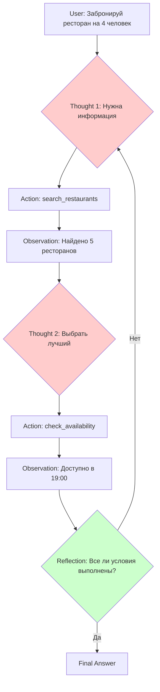

# 🧠 КАК АГЕНТЫ МЫСЛЯТ

## 📍 ВЫ ЗДЕСЬ

```
[✓]━━━[✓]━━━[✓]━━━[●]━━━[ ]━━━[ ]━━━[ ]━━━[ ]
 01    02    03    04    05    07    08    06
               МЫШЛЕНИЕ                    Будущее
```

**Прогресс:** 37.5% (3 из 8 глав) | **Время:** ~2.5 часа чтения

---

## 🎯 ЦЕЛЬ ГЛАВЫ

После прочтения вы будете понимать:
- 🧠 **7+ паттернов мышления** AI-агентов
- ⚡ **Chain-of-Thought** (CoT) — пошаговое рассуждение
- 🌳 **Tree-of-Thoughts** — ветвление вариантов
- 🚀 **5 современных Agentic Patterns (2025)** — production-ready паттерны
- 🔄 **ReAct** — чередование рассуждения и действия
- 🪞 **Reflection** — самоанализ и улучшение
- 🤝 **Multi-Agent Debate** — коллективное мышление
- 🏢 **Когда НЕ использовать агентов** — 80/20 hybrid подход

---

## 🚨 ГЛАВНЫЙ ВОПРОС

> **"Как ChatGPT генерирует умные ответы? Он ДУМАЕТ?"**

**Проблема:**
```
ChatGPT (базовый):
User: "2 + 2 = ?"
ChatGPT: "4"  ← Мгновенный ответ, но КАК?

User: "Реши сложную задачу по математике"
ChatGPT: [неправильный ответ]  ← Почему ошибся?
```

**Открытие (2022-2024):**
> AI становится УМНЕЕ, если мы заставляем его **ПОКАЗАТЬ** процесс мышления!

**Пример:**
```
ChatGPT (с Chain-of-Thought):
User: "Реши: У Алисы 23 яблока, она отдала 7 Бобу, потом купила еще 12. Сколько яблок?"

ChatGPT:
"Давайте решим пошагово:
1. Начальное количество: 23 яблока
2. Отдала Бобу: 23 - 7 = 16 яблок
3. Купила еще: 16 + 12 = 28 яблок
Ответ: 28 яблок"

→ Правильно! (за счет пошагового рассуждения)
```

---

## 📖 ЧТО ТАКОЕ COGNITIVE PATTERNS?

**Определение:**
> **Cognitive Pattern (когнитивный паттерн)** — это структурированный способ обработки информации и принятия решений AI-агентом.

**Аналогия с человеком:**
- Человек решает задачу → использует стратегию ("разделяй и властвуй", "попробуй и ошибись")
- AI решает задачу → использует паттерн (Chain-of-Thought, ReAct, Reflection)

**Зачем это важно:**
- 📈 Повышает точность (на 30-50% в сложных задачах)
- 🔍 Делает AI объяснимым (мы видим процесс мышления)
- 🛠️ Помогает выбрать правильный паттерн для задачи

---

## 1️⃣ CHAIN-OF-THOUGHT (CoT) — Цепочка рассуждений

### 📖 ОПРЕДЕЛЕНИЕ

**Chain-of-Thought prompting** — это техника, когда AI генерирует пошаговое рассуждение перед финальным ответом.

**Формула:**
```
Стандартный промпт: Вопрос → Ответ
CoT промпт: Вопрос → Рассуждение → Ответ
```

---

### 🧠 КАК РАБОТАЕТ

**Пример задачи:**
```
Задача: "В магазине 15 арбузов. 5 продали утром, 3 вечером. Привезли еще 12. Сколько сейчас?"

БЕЗ CoT:
ChatGPT: "19"  ← Неправильно! (должно быть 19, но путь неясен)

С CoT:
ChatGPT:
"Решим пошагово:
1. Начальное количество: 15 арбузов
2. Продали утром: 15 - 5 = 10
3. Продали вечером: 10 - 3 = 7
4. Привезли: 7 + 12 = 19
Ответ: 19 арбузов"

→ Правильно + понятен процесс
```

---

### 💡 ТЕХНИКИ CoT

#### 1. Zero-Shot CoT (2022)

**Промпт:**
```
User: "[Задача]"
"Let's think step by step."  ← Магическая фраза!
```

**Пример:**
```
User: "If John has 3 apples and buys 5 more, how many does he have? Let's think step by step."

ChatGPT:
"Step 1: John starts with 3 apples
Step 2: He buys 5 more apples
Step 3: Total = 3 + 5 = 8 apples
Answer: 8 apples"
```

**Источник:** *"Large Language Models are Zero-Shot Reasoners"* (Kojima et al., 2022)

---

#### 2. Few-Shot CoT

**Промпт:**
```
User:
"Пример 1:
Q: У Алисы 10 конфет, она съела 3. Сколько осталось?
A: Начальное: 10, Съела: 10-3=7. Ответ: 7.

Пример 2:
Q: У Боба 5 игрушек, он купил 2. Сколько теперь?
A: Начальное: 5, Купил: 5+2=7. Ответ: 7.

Теперь реши:
Q: У Карла 8 книг, он отдал 2, потом купил 4. Сколько?"

ChatGPT:
"Начальное: 8
Отдал: 8-2=6
Купил: 6+4=10
Ответ: 10 книг"
```

**Источник:** *"Chain-of-Thought Prompting Elicits Reasoning in Large Language Models"* (Wei et al., 2022)

---

### ✅ КОГДА ИСПОЛЬЗОВАТЬ

**Идеально для:**
- ✅ Математика (арифметика, алгебра)
- ✅ Логические задачи (пазлы, головоломки)
- ✅ Комплексные вопросы (требуют нескольких шагов)
- ✅ Объяснения (нужно показать процесс)

**Примеры:**
- Решение задач (математика, физика)
- Анализ данных (шаг за шагом)
- Debugging кода (пошаговая проверка)

---

### ❌ ОГРАНИЧЕНИЯ

**Проблема 1: Линейное мышление**
```
CoT генерирует ОДНУ цепочку рассуждений
Если первый шаг неправильный → весь ответ неправильный

Пример:
"Шаг 1: Предположим X = 5" ← Неправильное предположение
"Шаг 2: Тогда Y = X + 2 = 7"
"Шаг 3: Z = Y * 2 = 14"
→ Все последующие шаги будут неправильными
```

**Решение:** → **Tree-of-Thoughts** (следующий паттерн)

---

## 2️⃣ TREE-OF-THOUGHTS (ToT) — Дерево рассуждений

### 📖 ОПРЕДЕЛЕНИЕ

**Tree-of-Thoughts** — это техника, когда AI генерирует **несколько альтернативных** цепочек рассуждений и выбирает лучшую.

**Формула:**
```
CoT: Вопрос → [Рассуждение] → Ответ
ToT: Вопрос → [Рассуждение1, Рассуждение2, Рассуждение3] → Лучший ответ
```

---

### 🧠 КАК РАБОТАЕТ

**Визуализация:**
```
              [Вопрос]
                 │
     ┌───────────┼───────────┐
     │           │           │
  [Путь 1]    [Путь 2]    [Путь 3]
  X = 5       X = 7       X = 10
     │           │           │
  [Шаг 2]    [Шаг 2]    [Шаг 2]
  Y = 7       Y = 9       Y = 12
     │           │           │
  [Оценка]   [Оценка]   [Оценка]
  Score: 0.6  Score: 0.9  Score: 0.4
     │           │           │
     └───────────●───────────┘
              Выбрать
             лучший путь
              (Путь 2)
```

---

### 💡 ПРИМЕР

**Задача:** "Планирование путешествия на 5 дней в Париж с бюджетом $2000"

**ToT процесс:**

**Результат:**
```
Лучший план: План 4 (Микс)
Причина: Баланс между бюджетом, интересами, временем
Оценка: 0.92/1.0
```

---

### ✅ КОГДА ИСПОЛЬЗОВАТЬ

**Идеально для:**
- ✅ Планирование (путешествия, проекты)
- ✅ Креативные задачи (несколько вариантов дизайна)
- ✅ Стратегические решения (бизнес, инвестиции)
- ✅ Задачи с неопределенностью (нет "одного правильного ответа")

**Примеры:**
- Планирование маршрутов
- Генерация вариантов дизайна
- Выбор стратегий в играх (шахматы, го)

---

### ❌ ОГРАНИЧЕНИЯ

**Проблема: Вычислительная сложность**
```
ToT генерирует МНОЖЕСТВО путей → дорого (время, токены)

Пример:
3 альтернативы на каждом уровне
5 уровней глубины
→ 3^5 = 243 возможных пути
→ Нужно оценить ВСЕ

Для ChatGPT: 243 запроса → $$$
```

**Решение:** Ограничить глубину дерева (2-3 уровня).

---

## 🚀 СОВРЕМЕННЫЕ AGENTIC PATTERNS (2025)

### 📖 ВВЕДЕНИЕ

**Источники:**
- Microsoft Azure "Agent Factory" (2025)
- Andrew Ng: Agentic Workflows research
- Skywork AI: "20 Agentic AI Workflow Patterns" (2025)

**Ключевое открытие 2024-2025:**
> Не все задачи требуют AI-агентов. **95% enterprise AI проектов НЕ показывают P&L impact** из-за неправильного выбора паттернов.

**Hybrid подход (Microsoft Azure):**
```
80% задач = традиционные workflows (предсказуемые, дешевые, быстрые)
20% задач = agentic AI (сложные, требуют адаптации, дорогие)
```

**5 фундаментальных паттернов для production AI агентов:**

---

### Pattern 1: ReAct (Reasoning + Acting)

**Что это:**
> Агент **чередует** размышление и действие в непрерывном цикле: думает → действует → наблюдает → снова думает.

**Цикл ReAct:**
```
1. Thought (Размышление): "Что мне делать дальше?"
2. Action (Действие): Вызвать инструмент/API
3. Observation (Наблюдение): Получить результат
4. → Повторить до достижения цели
```

**Реальный пример (бронирование ресторана):**
```
Задача: "Забронируй столик в ресторане на 4 человек на сегодня вечером"

[Thought 1]: "Мне нужно узнать, какие рестораны свободны сегодня вечером.
              У меня нет внутренних данных. Нужно использовать поиск."

[Action 1]: search_restaurants(city="Москва", date="today", time="evening", people=4)

[Observation 1]: Найдено 3 ресторана:
                 - "Белый Кролик" (3 звезды Мишлен, свободно 19:00)
                 - "Twins Garden" (2 звезды, свободно 20:00)
                 - "Ruski" (1 звезда, свободно 18:30 и 21:00)

[Thought 2]: "У пользователя нет явных предпочтений. Выберу ресторан с лучшими
              отзывами и удобным временем. Белый Кролик — топ выбор."

[Action 2]: check_availability("Белый Кролик", time="19:00", people=4)

[Observation 2]: Доступно! Можно забронировать.

[Thought 3]: "Все условия подходят. Выполняю бронирование."

[Action 3]: make_reservation("Белый Кролик", time="19:00", people=4,
                             contact=user.phone)

[Observation 3]: Успешно забронировано! Confirmation ID: #BR-789456

[Final Answer]: "Готово! Забронировал столик в ресторане 'Белый Кролик'
                 на сегодня в 19:00 на 4 человека.
                 Код бронирования: #BR-789456.
                 Адрес: Смоленская площадь, 3."
```

**Где используется:**
- ✅ Customer service боты (поддержка клиентов)
- ✅ Виртуальные ассистенты (Siri, Alexa)
- ✅ E-commerce (подбор товаров + оформление заказа)
- ✅ Travel booking (поиск рейсов + бронирование отелей)

**Ключевое преимущество:**
> Агент НЕ пытается решить все сразу. Он делает **один шаг**, смотрит результат, адаптируется.

---

### Pattern 2: Tool Use (Использование инструментов)

**Что это:**
> Агент умеет **обращаться к внешним системам** (API, базы данных, калькуляторы, поисковики), а не хранит все знания в себе.

**Формула:**
```
Задача → Определить нужный инструмент → Вызвать → Использовать результат
```

**Реальный пример (бизнес-ассистент):**
```
Пользователь: "Мне нужно организовать встречу с командой завтра в 15:00.
                Проверь погоду и забронируй конференц-зал."

[Анализ задачи]:
Требуются 3 инструмента:
1. Calendar API — проверить занятость команды
2. Weather API — узнать прогноз погоды
3. Room Booking API — забронировать зал

[Execution]:

Step 1: Вызов Calendar API
Tool: get_team_availability(date="tomorrow", time="15:00")
Result: ✅ Все 5 человек свободны в 15:00

Step 2: Вызов Weather API
Tool: get_weather_forecast(location="Moscow", date="tomorrow", hour=15)
Result: ☀️ Солнечно, +22°C, без осадков

Step 3: Вызов Room Booking API
Tool: search_available_rooms(date="tomorrow", time="15:00", capacity=5)
Result: Доступны 2 зала:
        - Зал А (10 мест, проектор, whiteboard)
        - Зал Б (6 мест, TV экран)

Step 4: Бронирование
Tool: book_room(room="Зал А", date="tomorrow", time="15:00", duration=60)
Result: ✅ Забронировано

[Final Answer]:
"Готово!
✅ Все 5 участников свободны завтра в 15:00
☀️ Погода: солнечно, +22°C
🏢 Забронирован Зал А на 1 час (15:00-16:00)
📧 Приглашения отправлены команде"
```

**Типичные инструменты:**
- 🔍 **Search** — поиск в интернете (Google, Bing)
- 🗄️ **Database** — запросы к БД (SQL, MongoDB)
- 🧮 **Calculator** — вычисления (Python eval, WolframAlpha)
- 📧 **Email** — отправка писем (Gmail API, SendGrid)
- 📅 **Calendar** — управление событиями (Google Calendar)
- 💳 **Payments** — транзакции (Stripe, PayPal)
- 🌍 **Maps** — навигация (Google Maps, OpenStreetMap)

**Где используется:**
- ✅ Enterprise automation (интеграция с CRM, ERP)
- ✅ Workflow интеграция (Zapier, Make.com)
- ✅ Research assistants (поиск информации в интернете)
- ✅ Financial advisors (API бирж, криптовалют)

**Критично:**
> Агент НЕ хранит все знания в себе — он умеет **ОБРАЩАТЬСЯ** к нужным источникам. Это как человек, который не помнит номер телефона, но знает, где его найти.

**Разница с ReAct:**
```
ReAct = Reasoning + Tool Use (размышление + действие в цикле)
Tool Use = Только взаимодействие с инструментами (без итеративного мышления)

Пример:
Tool Use: "Вызови weather_api" → ответ
ReAct: "Думаю... нужна погода → вызываю API → получил данные → думаю...
         теперь нужно сравнить с прошлой неделей → вызываю API снова..."
```

---

### Pattern 3: Reflection (Самопроверка)

**Что это:**
> Агент **оценивает и улучшает** свои собственные ответы **без участия человека**.

**Формула:**
```
Первый ответ → Самокритика → Улучшенный ответ → (опционально) Повторить
```

**Реальный пример (генерация контента):**
```
Задача: "Напиши короткое описание компании Apple для инвесторов"

[Первый ответ (Draft 1)]:
"Apple — это компания, которая делает iPhone, iPad и Mac.
 Основана в 1976 году. Очень успешная компания."

[Reflection (Самокритика)]:
"Анализирую свой ответ:
❌ Слишком простой язык (не подходит для инвесторов)
❌ Нет финансовых метрик (инвесторам важны цифры)
❌ Не упомянуты конкурентные преимущества
❌ Нет информации о росте и перспективах
✅ Факты правильные (год основания, продукты)

Оценка: 3/10. Требуется полное переписывание."

[Улучшенный ответ (Draft 2)]:
"Apple Inc. (NASDAQ: AAPL) — глобальный технологический лидер с рыночной
 капитализацией $3 трлн (2024). Компания генерирует $400+ млрд годового
 дохода через экосистему устройств (iPhone, iPad, Mac), сервисов
 (App Store, iCloud, Apple Music) и носимой электроники (Apple Watch, AirPods).

 Ключевые метрики (2024):
 • Gross margin: 43%
 • P/E ratio: 28
 • Dividend yield: 0.5%

 Конкурентное преимущество: вертикальная интеграция (собственные чипы M-серии),
 премиальный брендинг, лояльная база 2+ млрд активных устройств."

[Reflection 2]:
"Анализ улучшенного ответа:
✅ Профессиональный язык для инвесторов
✅ Конкретные финансовые метрики
✅ Упомянуты конкурентные преимущества
✅ Указана рыночная позиция
⚠️ Можно добавить: риски и перспективы роста

Оценка: 8/10. Достаточно хорошо для использования."
```

**Где используется:**
- ✅ Генерация контента (блог-посты, маркетинговые тексты)
- ✅ Writing ассистенты (Grammarly AI, Jasper)
- ✅ Code generation (GitHub Copilot с ревью)
- ✅ Quality assurance (автоматическая проверка качества)

**Преимущество:**
> **Меньше человеческого контроля, выше качество на выходе.** Агент сам видит недостатки и исправляет их.

**Научное обоснование:**
> *"Reflexion: Language Agents with Verbal Reinforcement Learning"* (Zhou et al., 2023)
> Показали: **3-5 итераций рефлексии** повышают точность на **20-30%** в задачах программирования.

**Ограничение:**
```
❌ Дороже (каждая итерация = новый запрос к LLM)
❌ Медленнее (3 итерации = 3x время)
✅ Но: выше качество, меньше человеческих правок
```

---

### Pattern 4: Planning (Планирование)

**Что это:**
> Агент **разбивает сложную цель** на последовательность подзадач, выполняет их по порядку, адаптирует план при изменении условий.

**Формула:**
```
Большая задача → [Подзадача 1, Подзадача 2, ..., Подзадача N] → Выполнить → Объединить результат
```

**Реальный пример (организация конференции):**
```
Задача: "Организовать tech-конференцию на 100 человек через 2 месяца"

[Planning Phase]:
Агент разбивает на подзадачи:

1. Найти и забронировать площадку (срок: 2 недели)
   - Требования: 100+ мест, проектор, звук, Wi-Fi
   - Бюджет: до $5,000

2. Составить программу мероприятия (срок: 1 неделя)
   - Найти 5 спикеров (AI, blockchain, cybersecurity)
   - Согласовать темы выступлений

3. Разослать приглашения (срок: 3 дня)
   - Email-рассылка на 500 потенциальных участников
   - Регистрация через форму

4. Организовать кейтеринг (срок: 1 неделя)
   - Обед + кофе-брейки для 100 человек
   - Бюджет: $2,000

5. Подготовить презентационные материалы (срок: 3 дня)
   - Баннеры, брошюры, бейджи
   - Слайды для спикеров

[Execution with Monitoring]:

Week 1:
✅ Задача 1 (площадка): Забронирован конференц-центр "Сколково" на 15 мая
⚠️ Проблема: Обнаружено, что нужен доп. микрофон (+$300 к бюджету)
🔄 Адаптация плана: Одобрено увеличение бюджета до $5,300

Week 2:
✅ Задача 2 (программа): Подтверждены 4 из 5 спикеров
❌ Проблема: Один спикер отказался (занят в эту дату)
🔄 Адаптация плана: Поиск замены через LinkedIn, добавлена подзадача 2.1

Week 3:
✅ Задача 3 (приглашения): Разослано 500 писем, зарегистрировано 87 человек
✅ Задача 2.1: Найден новый спикер (эксперт по Web3)

Week 4-6:
✅ Задача 4 (кейтеринг): Заказан у "Catering Pro"
✅ Задача 5 (материалы): Напечатаны баннеры, брошюры, бейджи

[Final Result]:
✅ Конференция успешно организована
📊 Метрики: 95 участников, 5 спикеров, бюджет $7,300 (5% перерасход)
⭐ Feedback: 4.6/5.0 от участников
```

**Где используется:**
- ✅ Project management (автоматическое планирование проектов)
- ✅ Сложные бизнес-процессы (запуск продукта, маркетинговая кампания)
- ✅ Research workflows (научные исследования с несколькими этапами)
- ✅ Software development (разработка фичи от идеи до релиза)

**Ключевая особенность:**
> Агент НЕ просто создает статичный план. Он **мониторит прогресс** и **адаптирует план** при изменении условий.

**Методы планирования:**
1. **Chain Planning** — линейная последовательность (A → B → C)
2. **Graph Planning** — зависимости между задачами (A и B → C)
3. **Hierarchical Planning** — декомпозиция (Задача → Подзадачи → Под-подзадачи)

---

### Pattern 5: Multi-Agent Collaboration (Мульти-агентное сотрудничество)

**Что это:**
> **Несколько специализированных агентов** работают вместе, каждый решает свою часть задачи.

**Формула:**
```
Большая задача → [Agent 1 (роль А), Agent 2 (роль Б), ..., Agent N (роль N)]
              → Координация → Объединение результатов
```

**Реальный пример (разработка маркетинговой кампании):**
```
Задача: "Запустить маркетинговую кампанию для нового AI-продукта"

[Multi-Agent Team]:

1. Researcher Agent (роль: анализ рынка)
   Задачи:
   - Исследовать конкурентов (ChatGPT, Gemini, Claude)
   - Определить целевую аудиторию (разработчики, бизнес, студенты)
   - Найти незанятые ниши

   Результат:
   "Конкуренты фокусируются на general-purpose AI.
    Незанятая ниша: AI для малого бизнеса (accounting, HR, CRM).
    Целевая аудитория: владельцы SMB с бюджетом $50-500/месяц."

2. Copywriter Agent (роль: создание текстов)
   Задачи:
   - Написать слоганы (5 вариантов)
   - Создать email-рассылку (welcome series, 3 письма)
   - Подготовить landing page copy

   Результат:
   "Слоган: 'AI-ассистент, который работает на ВАС, а не на корпорации'
    Email 1: Welcome + ценностное предложение
    Email 2: Case study (как XYZ компания сэкономила 10 часов/неделю)
    Email 3: Спецпредложение (первый месяц -50%)"

3. Designer Agent (роль: визуальные концепции)
   Задачи:
   - Создать 3 варианта логотипа
   - Дизайн landing page (wireframe + mockup)
   - Баннеры для социальных сетей (LinkedIn, Twitter, Facebook)

   Результат:
   "Логотип: Минималистичный, синий + зеленый (trust + growth)
    Landing: Одностраничный, hero section + 3 benefits + testimonials + CTA
    Баннеры: 6 вариантов (A/B тестирование)"

4. Analyst Agent (роль: оценка эффективности)
   Задачи:
   - Предсказать CTR (click-through rate)
   - Оценить стоимость привлечения клиента (CAC)
   - Рекомендовать метрики для трекинга

   Результат:
   "Прогноз CTR: 2.5-3.5% (на основе исторических данных)
    Ожидаемый CAC: $15-25 (при бюджете $10K на рекламу)
    Метрики: Регистрации, активация, retention 7 дней"

5. Coordinator (роль: синхронизация команды)
   Задачи:
   - Согласовать timeline (2 недели на подготовку)
   - Убедиться, что тексты соответствуют дизайну
   - Проверить, что рекомендации аналитика учтены

   Результат:
   "✅ Все агенты завершили работу
    ✅ Копирайтинг и дизайн согласованы
    ✅ Прогнозы аналитика реалистичны
    🚀 Готовы к запуску через 3 дня"

[Final Campaign]:
📧 Email: 10,000 получателей, CTR 3.1%, 310 переходов
🌐 Landing: Conversion rate 15%, 47 регистраций
💰 CAC: $21 (в рамках прогноза)
⭐ ROI: 180% за первый месяц
```

**Где используется:**
- ✅ Сложные enterprise задачи (запуск продуктов, digital transformation)
- ✅ Creative workflows (создание контента, дизайн, маркетинг)
- ✅ Software development (архитектор + разработчик + тестировщик + ревьюер)
- ✅ Research (несколько ученых работают над проблемой)

**Преимущество:**
> **Специализация + параллельная работа = быстрее и качественнее.**

**Типы координации:**
1. **Sequential** — агенты работают по очереди (A → B → C)
2. **Parallel** — агенты работают одновременно (A, B, C → объединение)
3. **Hierarchical** — есть главный агент-координатор
4. **Debate** — агенты спорят, приходят к консенсусу

**Научное доказательство:**
> *"Improving Factuality and Reasoning in Language Models through Multiagent Debate"* (Du et al., 2023)
> Точность на математических задачах: **+15%** vs один агент

---

### 📊 СРАВНЕНИЕ ПАТТЕРНОВ

| Паттерн | Сложность | Автономность | Стоимость | Лучше всего для |
|---------|-----------|--------------|-----------|-----------------|
| **ReAct** | Низкая | Средняя | $ | Простые задачи с итерациями |
| **Tool Use** | Средняя | Средняя | $$ | Интеграция с системами |
| **Reflection** | Средняя | Высокая | $$$ | Качество контента |
| **Planning** | Высокая | Высокая | $$$ | Сложные проекты |
| **Multi-Agent** | Очень высокая | Очень высокая | $$$$ | Enterprise автоматизация |

**Легенда стоимости:**
- $ = 1-5 API вызовов
- $$ = 5-20 вызовов
- $$$ = 20-100 вызовов
- $$$$ = 100+ вызовов

---

### 🏢 PRODUCTION РЕАЛЬНОСТЬ 2025

**Microsoft Azure исследование (2025):**
> **95% enterprise AI проектов НЕ показывают P&L impact**

**Причины провалов:**
1. ❌ Использование агентов там, где достаточно простого workflow
2. ❌ Выбор сложного паттерна (Multi-Agent) для простой задачи
3. ❌ Отсутствие fault tolerance (агент ошибается → весь процесс падает)
4. ❌ Нет явных переходов между состояниями (state-machine)
5. ❌ Игнорирование стоимости (1000 API вызовов/день = $$$)

**Решение: Hybrid подход**
```
┌─────────────────────────────────────────┐
│ 80% ЗАДАЧ                               │
│ Традиционные workflows                  │
│ - Предсказуемые (A → B → C)             │
│ - Дешевые (без LLM вызовов)             │
│ - Быстрые (миллисекунды)                │
│ - Примеры: CRUD операции, email рассылки│
└─────────────────────────────────────────┘

┌─────────────────────────────────────────┐
│ 20% ЗАДАЧ                               │
│ Agentic AI                              │
│ - Сложные (требуют рассуждения)         │
│ - Требуют адаптации (нет фиксированного │
│   алгоритма)                            │
│ - Дорогие (LLM API вызовы)              │
│ - Примеры: кастомные рекомендации,      │
│   креативная генерация контента         │
└─────────────────────────────────────────┘
```

**Ключевой урок:**
> **НЕ ВСЕ ЗАДАЧИ ТРЕБУЮТ АГЕНТОВ.** Используйте паттерны там, где они ДЕЙСТВИТЕЛЬНО нужны.

**Правило выбора:**
```
if задача_предсказуема and имеет_фиксированный_алгоритм:
    use traditional_workflow  # Дешево, быстро
elif задача_сложная and требует_адаптации:
    use agentic_pattern       # Дорого, но качественно
else:
    use hybrid_approach       # Микс (workflow + AI в критических точках)
```

**Пример Hybrid подхода:**
```
E-commerce рекомендательная система:

80% — Traditional:
- Показать популярные товары (статичный список)
- Фильтры по категориям (SQL запрос)
- История заказов (БД lookup)

20% — Agentic AI:
- Персонализированные рекомендации на основе поведения пользователя
- Генерация уникальных описаний товаров
- Чат-бот для сложных вопросов

Результат: Баланс между стоимостью и качеством
```

---

### ✅ КОГДА ИСПОЛЬЗОВАТЬ КАКОЙ ПАТТЕРН

**Дерево решений:**
```
Есть доступ к внешним данным (API, БД)?
├─ ДА → Tool Use (обязательно)
│   └─ Нужны итерации (пробовать → смотреть → адаптироваться)?
│       ├─ ДА → ReAct (Reasoning + Tool Use)
│       └─ НЕТ → Просто Tool Use
│
└─ НЕТ (только внутренние знания LLM)
    └─ Задача креативная (несколько вариантов)?
        ├─ ДА → Reflection (если нужно качество)
        │   └─ Очень сложная задача (несколько этапов)?
        │       ├─ ДА → Planning
        │       └─ НЕТ → Просто Reflection
        │
        └─ НЕТ → Стандартный промпт (без специальных паттернов)

Очень сложная задача (несколько ролей)?
└─ ДА → Multi-Agent Collaboration

Критична стоимость?
└─ ДА → Используй минимальный паттерн (Tool Use < ReAct < Reflection < Planning < Multi-Agent)
```

---

### 🎯 СВЯЗЬ С ДРУГИМИ ГЛАВАМИ

**Откуда мы пришли:**
- **Глава 03** (Cognitive Patterns): Мы изучили базовые паттерны мышления (CoT, ToT, ReAct)
- **→ Текущая глава**: Узнали СОВРЕМЕННЫЕ production-ready паттерны (2025)

**Куда мы идем:**
- **Глава 05** (Мульти-агентные системы): Multi-Agent паттерн подробнее — как агенты координируются?
- **Глава 08** (Инструменты агентов): Tool Use — какие конкретные инструменты использовать?
- **Глава 11** (Ограничения агентов): Где паттерны НЕ работают и как их обойти?

---

### 📚 ИСТОЧНИКИ И ДОПОЛНИТЕЛЬНЫЕ МАТЕРИАЛЫ

**Исследования:**
1. Microsoft Azure Blog: "Agent Factory: When to use agentic AI vs traditional workflows" (2025)
2. Andrew Ng: "Agentic Workflows" keynote, BUILD 2024
3. Skywork AI: "20 Agentic AI Workflow Patterns for Production" (2025)
4. Du et al.: "Improving Factuality through Multiagent Debate" (2023)
5. Zhou et al.: "Reflexion: Language Agents with Verbal Reinforcement Learning" (2023)

**Практические руководства:**
- LangChain Documentation: "Agent Types" (2025)
- OpenAI Cookbook: "Function Calling Patterns"
- Anthropic: "Claude Agents Best Practices"

---

## 3️⃣ REACT (Reasoning + Acting) — Рассуждение + Действие

### 📖 ОПРЕДЕЛЕНИЕ

**ReAct** — это паттерн, когда AI **чередует** рассуждение (Reasoning) и действие (Acting).

**Формула:**
```
Цикл:
1. Thought (Рассуждение): "Что делать дальше?"
2. Action (Действие): Вызвать инструмент/API
3. Observation (Наблюдение): Результат действия
4. → Повторить до достижения цели
```

---

### 🧠 КАК РАБОТАЕТ

**Пример задачи:**
```
User: "Какая погода в Москве сейчас? И будет ли дождь завтра?"

ReAct процесс:

[Thought 1]: "Мне нужна информация о погоде. У меня нет внутренних данных. Нужно использовать weather_api."

[Action 1]: call_api("weather_api", city="Москва", type="current")

[Observation 1]: {"temperature": 15°C, "conditions": "облачно", "humidity": 70%}

[Thought 2]: "Теперь мне нужен прогноз на завтра. Вызову API снова."

[Action 2]: call_api("weather_api", city="Москва", type="forecast", day="tomorrow")

[Observation 2]: {"temperature": 12°C, "conditions": "дождь", "probability": 80%}

[Thought 3]: "У меня есть все данные. Могу ответить."

[Final Answer]: "Сейчас в Москве +15°C, облачно. Завтра ожидается дождь с вероятностью 80%, температура +12°C."
```

---

### 💡 ПРЕИМУЩЕСТВА vs CoT

| Критерий | Chain-of-Thought | ReAct |
|----------|------------------|-------|
| **Информация** | Только из памяти | + Внешние источники (API, БД) |
| **Действия** | Нет | Да (вызов инструментов) |
| **Обновление знаний** | Нет | Да (получает новые данные) |
| **Примеры** | Математика, логика | Поиск в интернете, работа с БД |

---

### 🛠️ РЕАЛИЗАЦИЯ (LangChain)


---

### ✅ КОГДА ИСПОЛЬЗОВАТЬ

**Идеально для:**
- ✅ Требуется доступ к внешним данным (API, БД)
- ✅ Динамическая информация (погода, новости, курсы валют)
- ✅ Комплексные задачи (несколько инструментов)
- ✅ Интерактивные системы (чат-боты с tools)

**Примеры:**
- Поиск информации в интернете
- Работа с базами данных
- Вызов внешних API (карты, погода, финансы)

**Источник:** *"ReAct: Synergizing Reasoning and Acting in Language Models"* (Yao et al., Princeton, 2022)

---

## 4️⃣ REFLECTION (Рефлексия) — Самоанализ и улучшение

### 📖 ОПРЕДЕЛЕНИЕ

**Reflection** — это паттерн, когда AI **анализирует свой собственный ответ** и улучшает его.

**Формула:**
```
1. Генерация первого ответа
2. Самокритика (что не так?)
3. Улучшенный ответ
```

---

### 🧠 КАК РАБОТАЕТ

**Пример:**
```
User: "Напиши эссе о искусственном интеллекте (500 слов)"

[Первый драфт]:
"Искусственный интеллект — это технология... [500 слов]"

[Reflection]:
"Анализирую свой ответ:
- ✅ Объем: 500 слов (хорошо)
- ❌ Структура: Нет четких разделов
- ❌ Примеры: Слишком абстрактно, нет конкретных примеров
- ❌ Вывод: Слабый, не запоминающийся

Проблемы: 2, 3, 4 требуют улучшения."

[Улучшенный ответ]:
"# Искусственный интеллект: Революция 21 века

## Введение
Искусственный интеллект (AI)...

## Примеры из реальной жизни
- ChatGPT (OpenAI, 2022): Помогает миллионам...
- AlphaGo (DeepMind, 2016): Победил чемпиона мира...

## Заключение
AI — не просто технология, это новая эра..."

→ Структурирован, с примерами, сильным выводом
```

---

### 💡 ТЕХНИКИ REFLECTION

#### 1. Self-Critique

**Промпт:**
```
User: "[Задача]"

ChatGPT: [Первый ответ]

User: "Проанализируй свой ответ. Что можно улучшить?"

ChatGPT:
"Анализ моего ответа:
1. Проблема: Слишком общий
2. Проблема: Нет примеров
3. Предложение: Добавить конкретные кейсы

Улучшенный ответ: [Версия 2]"
```

---

#### 2. Reflexion (Zhou et al., 2023)

---

### ✅ КОГДА ИСПОЛЬЗОВАТЬ

**Идеально для:**
- ✅ Креативные задачи (эссе, код, дизайн)
- ✅ Итеративное улучшение (редактирование текста)
- ✅ Обучение (анализ ошибок)
- ✅ Качество критично (нужен лучший результат)

---

## 5️⃣ META-COGNITION — "Мышление о мышлении"

### 📖 ОПРЕДЕЛЕНИЕ

**Meta-Cognition** — это способность агента **осознавать** свой процесс мышления и **адаптировать** стратегию.

**Пример:**
```
User: "Реши сложную задачу по физике"

Meta-Cognitive Agent:
"Анализирую задачу...
- Сложность: Высокая (квантовая механика)
- Мои знания: Средние (обучен до 2023)
- Стратегия: Нужно разбить на подзадачи + найти формулы

Выбираю паттерн: Tree-of-Thoughts (несколько подходов)
+ ReAct (поиск формул в интернете)"

→ Агент ВЫБИРАЕТ паттерн мышления для задачи
```

---

### 💡 ПРИМЕР

**Задача:** "Создай бизнес-план для AI-стартапа"

**Без Meta-Cognition (простой CoT):**
```
"Шаг 1: Определить целевую аудиторию
Шаг 2: Разработать продукт
Шаг 3: ...

→ Линейный план, может упустить важное
```

**С Meta-Cognition:**
```
[Meta-Level Thought]:
"Эта задача КРЕАТИВНАЯ и СТРАТЕГИЧЕСКАЯ.

Оценка подходов:
- CoT: Слишком линейный, упустит альтернативы ❌
- ToT: Хорошо для генерации вариантов ✅
- Reflection: Нужно для улучшения плана ✅

Стратегия: Использую ToT (3 варианта плана) + Reflection (улучшение лучшего)"

[Execution]:
1. Генерация 3 вариантов плана (ToT)
2. Выбор лучшего (оценка)
3. Улучшение через Reflection

→ Более качественный результат
```

---

### ✅ КОГДА ИСПОЛЬЗОВАТЬ

**Идеально для:**
- ✅ Сложные, многогранные задачи
- ✅ Нужна адаптация стратегии
- ✅ Автономные агенты (выбирают паттерн сами)

---

## 6️⃣ MULTI-AGENT DEBATE — Коллективное мышление

### 📖 ОПРЕДЕЛЕНИЕ

**Multi-Agent Debate** — это паттерн, когда **несколько AI-агентов** обсуждают проблему и приходят к консенсусу.

**Формула:**
```
1. Каждый агент генерирует ответ
2. Агенты читают ответы друг друга
3. Агенты спорят/дебатируют
4. Финальный ответ (консенсус или голосование)
```

---

### 🧠 КАК РАБОТАЕТ

**Пример:**
```
Задача: "Должны ли мы инвестировать в AI-стартап XYZ?"

[Agent 1 - Оптимист]:
"ДА! Рынок AI растет на 40% в год. Команда сильная. Потенциал огромный."

[Agent 2 - Скептик]:
"НЕТ. Конкуренция высокая (OpenAI, Google). Бизнес-модель неясна. Риски."

[Agent 3 - Аналитик]:
"УСЛОВНО ДА. Если они докажут product-market fit через 6 месяцев, тогда инвестировать."

[Дебаты]:
Agent 1: "Но ранний вход = больше equity!"
Agent 2: "Или больше риска потерять все."
Agent 3: "Предлагаю: Малая инвестиция сейчас ($50K), большая после proof."

[Консенсус]:
"Инвестировать $50K сейчас с опционом на $500K при достижении метрик."

→ Баланс между риском и возможностью
```

---

### 💡 ПРЕИМУЩЕСТВА

**vs Один агент:**
```
Один агент: Может иметь bias (оптимизм, пессимизм)
Multi-Agent: Разные точки зрения → более объективное решение
```

**Научное доказательство:**
> *"Improving Factuality and Reasoning in Language Models through Multiagent Debate"* (Du et al., 2023)

**Результаты:**
- Точность на математических задачах: +15% (vs один агент)
- Точность на фактах: +20%

---

### ✅ КОГДА ИСПОЛЬЗОВАТЬ

**Идеально для:**
- ✅ Важные решения (инвестиции, стратегия)
- ✅ Противоречивые мнения (нужен баланс)
- ✅ Сложные этические вопросы
- ✅ Креативный brainstorming

---

## 7️⃣ AGENTIC WORKFLOWS (Andrew Ng, 2024)

### 📖 ОПРЕДЕЛЕНИЕ

**Agentic Workflows** — это подход, когда AI **итеративно** работает над задачей, используя **4 паттерна** (Reflection, Tool Use, Planning, Multi-Agent).

**Andrew Ng (2024):**
> "Focus on agentic workflows, not just better models."

**Ключевая идея:**
```
Вместо: "Один запрос → Один ответ"
Использовать: "Итеративный процесс → Многократные улучшения"
```

---

### 🧠 4 ПАТТЕРНА AGENTIC WORKFLOWS

#### 1. **Reflection** (Рефлексия)
```
Задача → Ответ → Самокритика → Улучшенный ответ
```

#### 2. **Tool Use** (Использование инструментов)
```
Задача → Вызов API/БД/Код → Ответ на основе данных
```

#### 3. **Planning** (Планирование)
```
Задача → Разбить на подзадачи → Решить каждую → Объединить
```

#### 4. **Multi-Agent Collaboration** (Мульти-агентное сотрудничество)
```
Задача → Несколько агентов → Дебаты → Консенсус
```

---

### 💡 ПРИМЕР

**Задача:** "Написать исследовательскую статью о квантовых компьютерах"

**Agentic Workflow:**
```
[Planning Agent]:
"Разбиваю задачу на 5 этапов:
1. Исследование (поиск статей)
2. Структура (outline)
3. Написание черновика
4. Редактирование
5. Проверка фактов"

[Research Agent + Tool Use]:
Action: search_papers("quantum computing 2024")
Observation: [50 статей]
Action: summarize_top_10(papers)
Result: "Ключевые темы: квантовое превосходство, error correction, приложения"

[Writer Agent]:
Draft 1: [Пишет черновик]

[Reflection Agent]:
"Анализ черновика:
- Структура: OK
- Примеры: Недостаточно
- Технические термины: Нужны пояснения

Улучшения: Добавить 3 примера, упростить жаргон"

[Writer Agent]:
Draft 2: [Улучшенная версия]

[Fact-Checker Agent + Tool Use]:
Action: verify_facts(draft2)
Result: "Найдена 1 ошибка: Дата запуска Google Sycamore (2019, не 2020)"

[Final Result]:
Статья на 15 страниц, проверенная, с примерами, без ошибок
```

---

### ✅ КОГДА ИСПОЛЬЗОВАТЬ

**Идеально для:**
- ✅ Комплексные задачи (требуют >1 шага)
- ✅ Критичная точность (нельзя ошибаться)
- ✅ Креативность + Факты (исследовательские статьи)

**Источник:** Andrew Ng, "What's next for AI agentic workflows", BUILD 2024 keynote

---

## 📊 СРАВНИТЕЛЬНАЯ ТАБЛИЦА ПАТТЕРНОВ

| Паттерн | Когда использовать | Пример задачи |
|---------|-------------------|---------------|
| **Chain-of-Thought** | Логические задачи | Математика, задачи на логику |
| **Tree-of-Thoughts** | Планирование, креатив | Путешествия, дизайн |
| **ReAct** | Доступ к данным | Поиск, API, БД |
| **Reflection** | Итеративное улучшение | Эссе, код |
| **Meta-Cognition** | Сложные задачи | Выбор стратегии |
| **Multi-Agent Debate** | Важные решения | Инвестиции, этика |
| **Agentic Workflows** | Комплексные проекты | Исследовательские статьи |

---

## ✅ ЧЕКЛИСТ ПОНИМАНИЯ

**Базовые паттерны:**
- [ ] Могу объяснить Chain-of-Thought (CoT)
- [ ] Понимаю разницу CoT vs Tree-of-Thoughts
- [ ] Знаю, когда использовать ReAct (доступ к данным)
- [ ] Понимаю Reflection (самокритика + улучшение)

**Современные Agentic Patterns (2025):**
- [ ] Понимаю 5 фундаментальных паттернов (ReAct, Tool Use, Reflection, Planning, Multi-Agent)
- [ ] Знаю, когда использовать каждый паттерн (дерево решений)
- [ ] Понимаю правило 80/20 (Traditional Workflows vs Agentic AI)
- [ ] Могу объяснить, почему 95% enterprise AI проектов не показывают P&L impact
- [ ] Знаю разницу Tool Use vs ReAct

**Agentic Workflows:**
- [ ] Знаю 4 паттерна Agentic Workflows (Andrew Ng)
- [ ] Понимаю Hybrid подход (когда НЕ нужны агенты)

---

## 🎯 СЛЕДУЮЩИЙ ШАГ

### Что вы узнали:
- ✅ 7 паттернов мышления AI-агентов
- ✅ Как каждый паттерн работает (с примерами)
- ✅ Когда использовать каждый паттерн

### Почему следующая глава важна:
**Проблема:** Один агент может думать по-разному (CoT, ReAct, Reflection), но как **НЕСКОЛЬКО агентов** работают **ВМЕСТЕ**?

**Вопрос:** Как ChatGPT + Claude + Gemini могут сотрудничать над одной задачей?

**Ответ:** → **Мульти-агентные системы** (глава 5)

---

**→ [05-МУЛЬТИ-АГЕНТНЫЕ-СИСТЕМЫ.md](05-МУЛЬТИ-АГЕНТНЫЕ-СИСТЕМЫ.md)** — От одиночных агентов к командам

**Время:** ~2 часа | **Сложность:** 📊📊📊📊📊 (5/5)

---

**Вернуться к навигации:** [00-НАВИГАЦИЯ-ПО-РАЗДЕЛУ.md](00-НАВИГАЦИЯ-ПО-РАЗДЕЛУ.md)

---

## 📚 ТЕОРИЯ: КОГНИТИВНЫЕ ПРОЦЕССЫ АГЕНТОВ

### 🧠 Фундаментальные принципы мышления AI-агентов

**Что такое когнитивный процесс AI-агента?**
> Когнитивный процесс агента — это структурированная последовательность операций обработки информации, принятия решений и генерации действий, основанная на архитектуре языковой модели.

---

### 1️⃣ Как агенты принимают решения

**Механизм принятия решений:**

```
Входные данные (Input)
    ↓
[Контекстное окно]
    ↓
[Attention механизм] ← Взвешивание важности токенов
    ↓
[Transformer слои] ← Обработка паттернов
    ↓
[Вероятностное распределение] ← Расчет next token probabilities
    ↓
[Sampling стратегия] ← Temperature, Top-P, Top-K
    ↓
Выходной токен (Decision)
    ↓
Повторение цикла для следующего токена
```

**Ключевые компоненты:**

1. **Context Window** (Контекстное окно)
   - Хранит всю историю диалога
   - Ограничение: 4K-128K токенов (зависит от модели)
   - Влияет на способность "помнить" предыдущие решения

2. **Attention Mechanism** (Механизм внимания)
   - Определяет, какие части контекста важны для текущего решения
   - Self-attention: связывает токены внутри промпта
   - Cross-attention: связывает промпт с внутренними представлениями модели

3. **Probability Distribution** (Вероятностное распределение)
   - Каждое решение = выбор следующего токена из распределения вероятностей
   - Не детерминированный процесс (если Temperature > 0)
   - Пример: P("да") = 0.7, P("нет") = 0.2, P("возможно") = 0.1

4. **Sampling Strategies** (Стратегии выборки)
   - **Greedy**: Всегда выбирать токен с максимальной вероятностью
   - **Temperature**: Контроль "креативности" (0 = детерминизм, 1+ = разнообразие)
   - **Top-P (Nucleus)**: Выбор из топ-X токенов, сумма вероятностей которых = P
   - **Top-K**: Выбор только из K самых вероятных токенов

**Научное обоснование:**
> *"Attention Is All You Need"* (Vaswani et al., 2017) — Foundational paper for Transformer architecture
> *"The Curious Case of Neural Text Degeneration"* (Holtzman et al., 2019) — Анализ sampling стратегий

---

### 2️⃣ Reasoning (Рассуждение) vs Planning (Планирование)

**Reasoning (Рассуждение):**
> **Пошаговая логическая обработка** текущей проблемы для получения ответа.

**Характеристики:**
- ✅ Работает "здесь и сейчас" (одна задача)
- ✅ Линейная или ветвящаяся цепочка мыслей
- ✅ Фокус на **КАК** получить ответ
- ✅ Примеры паттернов: CoT, ToT, ReAct

**Пример Reasoning:**
```
Задача: "Сколько будет 15% от 240?"

Reasoning процесс:
1. Узнаю формулу: Процент = (Число × Процент) / 100
2. Подставляю: (240 × 15) / 100
3. Вычисляю: 3600 / 100 = 36
Ответ: 36

→ Фокус на вычислении ОДНОГО ответа
```

---

**Planning (Планирование):**
> **Разбиение сложной цели** на последовательность подзадач с учетом зависимостей и приоритетов.

**Характеристики:**
- ✅ Работает "в будущем" (последовательность действий)
- ✅ Иерархическая структура (задачи → подзадачи)
- ✅ Фокус на **ЧТО** делать и в **КАКОМ ПОРЯДКЕ**
- ✅ Примеры паттернов: Planning, Hierarchical Task Networks (HTN)

**Пример Planning:**
```
Задача: "Организовать день рождения через 2 недели"

Planning процесс:
1. Декомпозиция на задачи:
   - Найти площадку (deadline: 10 дней до)
   - Заказать торт (deadline: 3 дня до)
   - Разослать приглашения (deadline: 7 дней до)
   - Купить декорации (deadline: 2 дня до)

2. Определение зависимостей:
   - "Разослать приглашения" зависит от "Найти площадку" (нужен адрес)
   - "Заказать торт" зависит от "Разослать приглашения" (узнать кол-во гостей)

3. Приоритизация:
   - Критично: Площадка, Торт
   - Важно: Приглашения
   - Можно позже: Декорации

4. Финальный план:
   День 1-4: Искать площадку
   День 5: Разослать приглашения (зная адрес)
   День 7: Подтвердить количество гостей
   День 11: Заказать торт (зная количество)
   День 12-13: Купить декорации

→ Фокус на ПОСЛЕДОВАТЕЛЬНОСТИ действий
```

**Сравнение:**

| Критерий | Reasoning | Planning |
|----------|-----------|----------|
| **Временная перспектива** | Настоящее (решение сейчас) | Будущее (последовательность) |
| **Структура** | Линейная/ветвящаяся | Иерархическая |
| **Цель** | Получить ответ | Построить план действий |
| **Зависимости** | Слабые (шаги независимы) | Сильные (задачи зависимы) |
| **Примеры задач** | Математика, логика | Проекты, workflow |

---

### 3️⃣ Chain-of-Thought (CoT) vs Tree-of-Thoughts (ToT)

**Chain-of-Thought (Цепочка рассуждений):**

**Архитектура:**
```
Вопрос → [Шаг 1] → [Шаг 2] → [Шаг 3] → Ответ
         (линейная последовательность)
```

**Математическая модель:**
```
P(ответ | вопрос) = P(шаг1 | вопрос)
                    × P(шаг2 | вопрос, шаг1)
                    × P(шаг3 | вопрос, шаг1, шаг2)
                    × P(ответ | вопрос, шаг1, шаг2, шаг3)
```

**Сильные стороны:**
- ✅ Простота: генерация одной цепочки рассуждений
- ✅ Скорость: O(N) операций (N = количество шагов)
- ✅ Эффективность: 1 API вызов
- ✅ Объяснимость: видна логика рассуждения

**Слабые стороны:**
- ❌ Локальные ошибки: ошибка на шаге 1 → неправильный финальный ответ
- ❌ Нет альтернатив: не рассматриваются другие подходы
- ❌ Сложно корректировать: нельзя "откатить" неправильный шаг

**Пример:**
```
Задача: "Реши: 2x + 5 = 13"

CoT процесс:
Шаг 1: Вычитаю 5 из обеих частей: 2x = 8
Шаг 2: Делю на 2: x = 4
Ответ: x = 4

→ Одна цепочка, правильный ответ
```

---

**Tree-of-Thoughts (Дерево рассуждений):**

**Архитектура:**
```
                [Вопрос]
                   │
       ┌───────────┼───────────┐
       │           │           │
    [Путь 1]    [Путь 2]    [Путь 3]
       │           │           │
    [Оценка]    [Оценка]    [Оценка]
    Score:0.6   Score:0.9   Score:0.4
       │           │           │
       └───────────●───────────┘
              (Выбор лучшего)
```

**Математическая модель:**
```
P(ответ | вопрос) = max(
    P(путь1 | вопрос) × Score(путь1),
    P(путь2 | вопрос) × Score(путь2),
    P(путь3 | вопрос) × Score(путь3)
)
```

**Сильные стороны:**
- ✅ Исследование альтернатив: несколько подходов
- ✅ Самокоррекция: может отбросить неправильные пути
- ✅ Креативность: генерирует неожиданные решения
- ✅ Устойчивость к ошибкам: ошибка в одном пути не критична

**Слабые стороны:**
- ❌ Вычислительная сложность: O(B^D) (B = branching factor, D = depth)
- ❌ Стоимость: множественные API вызовы
- ❌ Время: медленнее, чем CoT
- ❌ Оценка путей: нужна функция Score (часто эвристическая)

**Пример:**
```
Задача: "Реши креативную задачу: Как увеличить продажи на 50% за 3 месяца?"

ToT процесс:

Путь 1 (Маркетинг):
- Запустить рекламную кампанию ($50K бюджет)
- Привлечь блогеров (influencer marketing)
- SEO оптимизация сайта
Оценка: Стоимость высокая, риск средний → Score: 0.6

Путь 2 (Продукт):
- Добавить новую фичу (AI-рекомендации)
- Улучшить UX (A/B тесты)
- Запустить реферальную программу (скидки за друзей)
Оценка: Долгосрочный эффект, низкий риск → Score: 0.9 ✅

Путь 3 (Ценообразование):
- Снизить цены на 20% (промо-акция)
- Создать премиум-тариф (+30% к цене)
- Ввести подписочную модель
Оценка: Быстрый эффект, но может снизить маржу → Score: 0.4

→ Выбор: Путь 2 (Product-led growth)
```

**Сравнение CoT vs ToT:**

| Критерий | CoT | ToT |
|----------|-----|-----|
| **Структура** | Линейная цепочка | Дерево альтернатив |
| **Количество решений** | 1 путь | N путей (обычно 3-5) |
| **Вычислительная сложность** | O(N) | O(B^D) |
| **Стоимость (API вызовы)** | 1 вызов | N вызовов |
| **Лучше для** | Точные задачи (математика) | Креативные задачи (планирование) |
| **Ошибки** | Критичны (весь путь неверен) | Некритичны (есть альтернативы) |

**Научное обоснование:**
> *"Tree of Thoughts: Deliberate Problem Solving with Large Language Models"* (Yao et al., 2023)
> Показали: ToT превосходит CoT на **74%** в креативных задачах (Game of 24, Creative Writing)

---

### 4️⃣ Ограничения мышления агентов

**Фундаментальные ограничения AI-агентов (2025):**

#### 1. **Отсутствие понимания (No True Understanding)**

**Проблема:**
> AI-агенты обрабатывают **статистические паттерны** в тексте, а не понимают смысл.

**Доказательство (Adversarial Examples):**
```
Пример 1:
User: "У меня 3 яблока. Я съел 2. Сколько осталось?"
AI: "1 яблоко" ✅ (правильно по паттерну)

User: "У меня 3 яблока. Я съел 2. Сколько осталось в холодильнике?"
AI: "1 яблоко" ❌ (неправильно! Яблоки не обязательно в холодильнике)

→ AI не понимает КОНТЕКСТ, только паттерн "3 - 2 = 1"
```

**Пример 2 (Тест Winograd Schema):**
```
"Собака гналась за кошкой, потому что она была голодной. Кто был голодным?"
Правильный ответ: Собака (требует понимания причинности)

AI часто ошибается, выбирая "кошка" (ближайшее существительное).
```

**Научное обоснование:**
> *"The Winograd Schema Challenge"* (Levesque et al., 2012) — тест на здравый смысл
> Лучшие LLM (2024): 85-90% точность (vs 100% для человека)

---

#### 2. **Ограничения контекстного окна (Context Window Limitations)**

**Проблема:**
> Агенты могут "помнить" только ограниченное количество токенов.

**Технические лимиты (2025):**
| Модель | Контекстное окно | Примерно страниц текста |
|--------|------------------|-------------------------|
| GPT-4 (базовая) | 8,192 токенов | ~6-8 страниц |
| GPT-4 Turbo | 128,000 токенов | ~100 страниц |
| Claude 3 Opus | 200,000 токенов | ~150 страниц |
| Gemini 1.5 Pro | 1,000,000 токенов | ~700-800 страниц |

**Последствия:**
```
Задача: "Проанализируй 500-страничную книгу и найди все упоминания персонажа X"

Проблема:
- Если книга > context window → AI не может прочитать всю книгу за раз
- Решение 1: Разбить на чанки (chunks) → но теряется глобальный контекст
- Решение 2: Использовать RAG (Retrieval-Augmented Generation) → дороже, сложнее
```

**Эффект "Lost in the Middle":**
> *"Lost in the Middle: How Language Models Use Long Contexts"* (Liu et al., 2023)
> Показали: AI лучше запоминает информацию в **начале** и **конце** контекста, хуже — в **середине**.

---

#### 3. **Вычислительная стоимость (Computational Cost)**

**Проблема:**
> Сложные паттерны (ToT, Multi-Agent) требуют множественных API вызовов.

**Пример стоимости (GPT-4, 2025):**
```
Задача: Генерация бизнес-плана

Паттерн 1: Simple Prompt (1 вызов)
Стоимость: $0.03 (input) + $0.06 (output) = $0.09

Паттерн 2: CoT (1 вызов с детализацией)
Стоимость: $0.05 (input) + $0.15 (output) = $0.20

Паттерн 3: ToT (5 альтернативных путей)
Стоимость: ($0.05 + $0.15) × 5 = $1.00

Паттерн 4: Multi-Agent (3 агента, 2 итерации каждый)
Стоимость: ($0.05 + $0.15) × 3 × 2 = $1.20

Паттерн 5: Agentic Workflow (Planning + ReAct + Reflection)
Стоимость: $0.20 (planning) + $0.60 (ReAct, 3 итерации) + $0.40 (reflection, 2 раза) = $1.20
```

**Масштабирование:**
```
1 запрос с Multi-Agent = $1.20
1,000 запросов/день = $1,200/день
30 дней = $36,000/месяц

→ Enterprise проектам критично оптимизировать паттерны!
```

---

#### 4. **Hallucinations (Галлюцинации)**

**Проблема:**
> AI генерирует правдоподобные, но **ложные** утверждения.

**Примеры:**
```
Пример 1 (Фактические ошибки):
User: "Кто был президентом США в 1800 году?"
AI: "Джордж Вашингтон" ❌ (правильно: Джон Адамс)

Причина: Вашингтон — более частое имя в тренировочных данных → выше вероятность

Пример 2 (Выдуманные источники):
User: "Дай ссылку на исследование о CoT"
AI: "Источник: Wei et al. (2022) 'Chain-of-Thought Prompting' в журнале Nature" ❌

Правда: Статья опубликована в arXiv, не в Nature
```

**Научное обоснование:**
> *"Survey of Hallucination in Natural Language Generation"* (Ji et al., 2023)
> Частота галлюцинаций: 3-27% (зависит от модели и задачи)

**Методы борьбы:**
- ✅ **Retrieval-Augmented Generation (RAG)**: Привязать AI к внешним источникам
- ✅ **Fact-checking agents**: Отдельный агент проверяет факты
- ✅ **Citation требования**: Промпт "Приведи источник для каждого факта"

---

#### 5. **Отсутствие долговременной памяти (No Long-Term Memory)**

**Проблема:**
> По умолчанию AI-агенты **не запоминают** прошлые сессии.

**Ограничение:**
```
Сессия 1:
User: "Меня зовут Алекс, я разработчик Python"
AI: "Приятно познакомиться, Алекс!"

[Новая сессия]

Сессия 2:
User: "Помнишь, как меня зовут?"
AI: "Извините, я не помню предыдущих разговоров" ❌
```

**Решения:**
- **Vector Databases**: Сохранять embeddings диалогов (Pinecone, Weaviate)
- **Conversation History**: Загружать историю в контекст (но ограничено размером окна)
- **Memory Management Agents**: Специальные агенты для управления памятью

---

#### 6. **Неспособность к истинному планированию (No True Planning)**

**Проблема:**
> AI-агенты имитируют планирование через текстовую генерацию, но не обладают **internal world model**.

**Сравнение с человеком:**
```
Человек планирует:
1. Создает ментальную модель задачи (визуализация)
2. Симулирует действия в уме (предсказывает последствия)
3. Адаптирует план на основе обратной связи из симуляции

AI-агент "планирует":
1. Генерирует текст: "Шаг 1: Сделать X"
2. Генерирует текст: "Шаг 2: Сделать Y"
3. Надеется, что последовательность логична

→ Нет истинного понимания причинно-следственных связей
```

**Доказательство (Blocksworld задача):**
```
Задача: Переставить блоки A, B, C из состояния [A на B на C] в [C на B на A]

Человек:
- Визуализирует конфигурацию блоков
- Понимает физические ограничения (нельзя переместить нижний блок, пока верхний не убран)
- Планирует: Убрать A → Убрать B → Поставить C → Поставить B → Поставить A

AI-агент:
- Генерирует план текстом
- Может предложить невозможные действия ("Переставь C, пока A и B на нем")
- Требует feedback loops для коррекции ошибок
```

---

## ❓ КОНТРОЛЬНЫЕ ВОПРОСЫ

### Раздел 1: Принятие решений агентами

1. **Опишите полный цикл принятия решения AI-агентом:**
   - Какие компоненты участвуют от получения промпта до генерации ответа?
   - Почему решения AI недетерминированные (при Temperature > 0)?
   - Как механизм Attention влияет на качество решений?

2. **Сравните стратегии sampling:**
   - В чем разница между Greedy decoding и Temperature sampling?
   - Когда использовать Top-P (Nucleus) sampling vs Top-K?
   - Как параметр Temperature влияет на креативность ответов?

3. **Контекстное окно и память:**
   - Почему размер контекстного окна критичен для принятия решений?
   - Что такое эффект "Lost in the Middle" и как его минимизировать?
   - Чем отличается контекстное окно от долговременной памяти?

### Раздел 2: Reasoning и Planning

4. **Reasoning vs Planning:**
   - В чем фундаментальная разница между reasoning и planning?
   - Приведите примеры задач, где нужен reasoning, но НЕ нужен planning
   - Объясните, почему planning требует учета зависимостей между задачами

5. **Методы планирования:**
   - Что такое Hierarchical Task Networks (HTN)?
   - В чем разница между Chain Planning и Graph Planning?
   - Когда использовать каждый метод?

6. **Адаптация планов:**
   - Как агенты адаптируют планы при изменении условий?
   - Почему статичные планы неэффективны в динамичных средах?
   - Приведите пример self-correcting planning процесса

### Раздел 3: Chain-of-Thought vs Tree-of-Thoughts

7. **Архитектурные различия:**
   - Объясните математическую модель CoT (вероятностная цепочка)
   - Как ToT использует branching и evaluation для выбора путей?
   - Почему ToT имеет экспоненциальную сложность O(B^D)?

8. **Применение паттернов:**
   - Для каких задач CoT превосходит ToT и почему?
   - Когда дополнительная стоимость ToT оправдана?
   - Как комбинировать CoT и ToT в гибридном подходе?

9. **Оценка путей в ToT:**
   - Какие методы оценки (scoring) путей существуют?
   - Как определить, какой путь в дереве рассуждений лучший?
   - Можно ли использовать внешние метрики для оценки?

### Раздел 4: Ограничения мышления

10. **Фундаментальные ограничения:**
    - Почему AI-агенты не обладают "истинным пониманием"?
    - Что такое Winograd Schema Challenge и какие результаты у LLM?
    - Как adversarial examples демонстрируют отсутствие понимания контекста?

11. **Hallucinations:**
    - В чем причина галлюцинаций в языковых моделях?
    - Какие методы борьбы с галлюцинациями наиболее эффективны?
    - Как Retrieval-Augmented Generation (RAG) снижает hallucinations?

12. **Вычислительная стоимость:**
    - Почему Multi-Agent паттерны дороже, чем простые промпты?
    - Как рассчитать стоимость Agentic Workflow для 1000 запросов/день?
    - Когда оправдано использовать дорогие паттерны (ToT, Multi-Agent)?

---

## 📝 ПРАКТИЧЕСКИЕ ЗАДАНИЯ

### Задание 1: Анализ процесса мышления (Базовое, 20 минут)

**Цель:** Понять, как AI-агент принимает решения на примере математической задачи.

**Задача:**
```
Промпт: "Реши задачу: У фермера 17 овец. 9 сбежали, но он купил еще 12.
         Затем продал 5. Сколько овец сейчас?"
```

**Шаги:**

1. **Запусти Chain-of-Thought:**
   - Добавь в промпт: "Let's think step by step."
   - Запиши пошаговое рассуждение AI

2. **Проанализируй процесс:**
   - Сколько шагов сгенерировал AI?
   - Каждый ли шаг логически следует из предыдущего?
   - Есть ли "пропущенные" шаги (implicit reasoning)?

3. **Проверь Attention:**
   - Какие числа из промпта AI использует в каждом шаге?
   - Как AI понимает порядок событий ("сбежали" → "купил" → "продал")?

4. **Экспериментируй с Temperature:**
   - Запусти ту же задачу с Temperature = 0 (детерминизм)
   - Запусти с Temperature = 1.0 (креативность)
   - Сравни результаты: изменился ли процесс рассуждения?

**Ожидаемый результат:**
- Документ с пошаговым анализом рассуждения AI
- Выводы о влиянии Temperature на стабильность решений
- Понимание, как Attention распределяется по токенам в промпте

---

### Задание 2: Сравнение стратегий reasoning (Продвинутое, 35 минут)

**Цель:** Сравнить эффективность CoT и ToT на задаче планирования.

**Задача:**
```
Сценарий: "Ты менеджер проекта. Нужно запустить мобильное приложение за 6 недель
           с командой из 3 разработчиков. Бюджет $30,000. Создай план."
```

**Шаги:**

1. **Реализуй CoT подход:**
   ```
   Промпт: "Создай пошаговый план запуска приложения. Let's think step by step:
            1. Определи этапы (design, development, testing, launch)
            2. Распредели время на каждый этап
            3. Рассчитай бюджет
            4. Назначь задачи разработчикам"
   ```
   - Запиши сгенерированный план
   - Оцени: учитывает ли план зависимости между этапами?

2. **Реализуй ToT подход:**
   ```
   Промпт: "Создай 3 альтернативных плана запуска приложения:
            План 1: Agile (2-week sprints, MVP focus)
            План 2: Waterfall (sequential: design → dev → test)
            План 3: Hybrid (parallel work on modules)

            Для каждого плана:
            - Оцени риски (1-10)
            - Оцени вероятность успеха (%)
            - Рассчитай стоимость

            Выбери лучший план на основе оценок."
   ```
   - Запиши все 3 плана
   - Проанализируй, как AI оценивает каждый путь
   - Какой план AI выбрал и почему?

3. **Сравни результаты:**
   | Критерий | CoT | ToT |
   |----------|-----|-----|
   | Количество сгенерированных вариантов | | |
   | Учет рисков | | |
   | Детализация задач | | |
   | Реалистичность бюджета | | |
   | Время генерации (сек) | | |
   | Стоимость (API токены) | | |

4. **Бонус: Hybrid подход**
   - Используй ToT для выбора стратегии (Agile/Waterfall/Hybrid)
   - Затем используй CoT для детализации выбранного плана
   - Сравни с pure ToT: улучшилось ли качество?

**Ожидаемый результат:**
- Таблица сравнения CoT vs ToT
- Вывод: когда ToT оправдан, когда CoT достаточно
- Понимание trade-off между качеством и стоимостью

---

### Задание 3: Диаграмма процесса принятия решений (Проектное, 60 минут)

**Цель:** Создать визуальную диаграмму полного цикла reasoning агента с учетом ограничений.

**Задача:**
Построить flowchart/sequence diagram для задачи:
```
"AI-агент должен забронировать ресторан на сегодня вечером для 4 человек"
```

**Требования:**

1. **Основной процесс (ReAct паттерн):**
   ```
   [Thought] → [Action] → [Observation] → [Thought] → ... → [Final Answer]
   ```

   Детализируй каждый шаг:
   - **Thought 1**: Что агент думает? (reasoning)
   - **Action 1**: Какой инструмент вызывает? (search_restaurants, check_availability)
   - **Observation 1**: Какие данные получает?
   - **Thought 2**: Как анализирует результаты?
   - ... (продолжить до Final Answer)

2. **Добавь компоненты decision-making:**
   - **Context Window**: Покажи, что хранится в контексте на каждом шаге
   - **Attention**: Какие части контекста важны для каждого Thought?
   - **Sampling**: Где происходит вероятностный выбор?

3. **Покажи ограничения:**
   - **Точка галлюцинации**: Где агент может выдумать несуществующий ресторан?
   - **Context limit**: Если история слишком длинная, что выпадет из контекста?
   - **Tool failure**: Что делать, если API ресторанов не отвечает?

4. **Добавь Reflection:**
   - После генерации ответа: агент проверяет, все ли условия выполнены
     - ✅ Дата: сегодня?
     - ✅ Время: вечер?
     - ✅ Количество: 4 человека?
   - Если нет → regenerate с коррекцией

5. **Визуализация:**
   Используй один из инструментов:
   - **Mermaid** (текстовый формат для диаграмм)
   - **Draw.io / Excalidraw** (визуальные редакторы)
   - **PlantUML** (code-based диаграммы)

**Пример структуры (Mermaid):**


**Ожидаемый результат:**
- Диаграмма процесса принятия решений (flowchart или sequence diagram)
- Аннотации к каждому компоненту (Context, Attention, Sampling)
- Визуализация точек отказа (hallucinations, context overflow, tool errors)
- Понимание полного цикла reasoning с учетом реальных ограничений

---

## 🎯 НАВИГАЦИЯ

**← Предыдущая глава:**
[03-АРХИТЕКТУРА-АГЕНТОВ.md](03-АРХИТЕКТУРА-АГЕНТОВ.md) — Внутреннее устройство агентов

**→ Следующая глава:**
[05-МУЛЬТИ-АГЕНТНЫЕ-СИСТЕМЫ.md](05-МУЛЬТИ-АГЕНТНЫЕ-СИСТЕМЫ.md) — От одиночных агентов к командам

**Время следующей главы:** ~2.5 часа | **Сложность:** 📊📊📊📊📊 (5/5)

---

**Вернуться к навигации:** [00-НАВИГАЦИЯ-ПО-РАЗДЕЛУ.md](00-НАВИГАЦИЯ-ПО-РАЗДЕЛУ.md)
