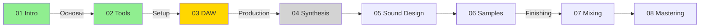

# 🗺️ ПАТТЕРНЫ НАВИГАЦИИ И СВЯЗНОСТИ УРОКОВ

> Анализ курса "Agentic VibeCoding" для применения в курсе "AI Music Production"

---

## 📊 ВЫЯВЛЕННЫЕ ПАТТЕРНЫ

### 1. СТРУКТУРА НАВИГАЦИОННЫХ БЛОКОВ

#### Паттерн A: Навигация в начале урока (Контекст)

```markdown
## 📍 ВЫ ЗДЕСЬ

```
[●]━━━[ ]━━━[ ]━━━[ ]━━━[ ]━━━[ ]━━━[ ]━━━[ ]
 01    02    03    04    05    06    07    08
Основы                                  Будущее
```

**Прогресс:** 0% (0 из 8 глав) | **Время:** ~1.5 часа чтения
```

**Применение для AI Music Production:**
```markdown
## 📍 ВЫ ЗДЕСЬ

```
[●]━━━[ ]━━━[ ]━━━[ ]━━━[ ]━━━[ ]━━━[ ]
 01    02    03    04    05    06    07
Основы  DAW  Синтез  Mixing  Master  Promo
```

**Прогресс:** 0% (0 из 7 модулей) | **Время:** ~2 часа чтения
```

---

#### Паттерн B: Навигация в конце урока (Направление)

```markdown
## 🧭 НАВИГАЦИЯ

**← Предыдущая глава:** [02-ТИПЫ-АГЕНТОВ.md](02-ТИПЫ-АГЕНТОВ.md)

**→ Следующая глава:** [04-КАК-АГЕНТЫ-МЫСЛЯТ.md](04-КАК-АГЕНТЫ-МЫСЛЯТ.md)

**↑ Вернуться к навигации:** [00-НАВИГАЦИЯ-ПО-РАЗДЕЛУ.md](00-НАВИГАЦИЯ-ПО-РАЗДЕЛУ.md)
```

**Применение:**
```markdown
## 🧭 НАВИГАЦИЯ

**← Предыдущий урок:** [01-INTRODUCTION-TO-AI-MUSIC.md](01-INTRODUCTION-TO-AI-MUSIC.md)

**→ Следующий урок:** [03-DAW-SETUP-AND-WORKFLOW.md](03-DAW-SETUP-AND-WORKFLOW.md)

**↑ Вернуться к содержанию:** [README.md](README.md)
```

---

#### Паттерн C: Детальная навигация с превью

```markdown
### 🎯 Следующие шаги:

**→ Следующая статья:** [**02-УСТАНОВКА-CLAUDE-CODE.md**](02-УСТАНОВКА-CLAUDE-CODE.md)

**Что будет:**
- Установка Claude Code CLI за 5 минут
- Первая команда в терминале
- Выбор тарифа (бесплатный vs Pro)
- Готовность к созданию вашего первого агента!

**Время:** 15 минут чтения + 10 минут практики
```

**Применение:**
```markdown
### 🎯 Следующие шаги:

**→ Следующий урок:** [**03-DAW-SETUP-AND-WORKFLOW.md**](03-DAW-SETUP-AND-WORKFLOW.md)

**Что вас ждёт:**
- Установка и настройка Ableton Live/FL Studio
- Первый проект с AI-инструментами
- Интеграция MIDI-контроллера
- Создание первого AI-бита!

**Время:** 20 минут чтения + 30 минут практики
```

---

### 2. ИСПОЛЬЗОВАНИЕ СЛОВАРЯ (GLOSSARY)

#### Паттерн A: Inline-ссылки на термины

```markdown
> **"ChatGPT это [AI-агент](../СЛОВАРЬ-ВАЙБКОДЕРА.md#ai-агент)?"**
> **💡 Новые термины?** См. [📖 СЛОВАРЬ ВАЙБКОДЕРА](../СЛОВАРЬ-ВАЙБКОДЕРА.md)
```

**Применение:**
```markdown
> **"MIDI это [протокол управления](../GLOSSARY.md#midi-protocol)?"**
> **💡 Незнакомые термины?** См. [📖 МУЗЫКАЛЬНЫЙ СЛОВАРЬ](../GLOSSARY.md)
```

---

#### Паттерн B: Блок терминов в конце урока

```markdown
## 💡 Термины из этой главы

Подробнее см. [📖 СЛОВАРЬ ВАЙБКОДЕРА](../СЛОВАРЬ-ВАЙБКОДЕРА.md):
- [AI-агент](../СЛОВАРЬ-ВАЙБКОДЕРА.md#ai-агент) — автономная система
- [Восприятие](../СЛОВАРЬ-ВАЙБКОДЕРА.md#perception) — получение информации
- [Автономность](../СЛОВАРЬ-ВАЙБКОДЕРА.md#autonomy) — способность действовать
```

**Применение:**
```markdown
## 💡 Термины из этого урока

Подробнее см. [📖 МУЗЫКАЛЬНЫЙ СЛОВАРЬ](../GLOSSARY.md):
- [DAW](../GLOSSARY.md#daw) — Digital Audio Workstation
- [MIDI](../GLOSSARY.md#midi) — Musical Instrument Digital Interface
- [Latency](../GLOSSARY.md#latency) — задержка звука
- [Quantization](../GLOSSARY.md#quantization) — выравнивание нот
```

---

### 3. СЕКЦИЯ "ЧТО ВЫ УЗНАЕТЕ" (LEARNING OUTCOMES)

#### Паттерн: Чёткие метрики обучения

```markdown
## 🎯 Что вы узнаете (30 минут чтения)

После прочтения этой статьи вы:
- ✅ Поймете разницу между традиционным программированием и VibeCoding
- ✅ Узнаете, почему agentic подход — это революция (не эволюция!)
- ✅ Освоите 5 ключевых принципов агентного кодинга
- ✅ Увидите реальные примеры: до и после
- ✅ Решите, подходит ли вам этот стиль разработки
```

**Применение:**
```markdown
## 🎯 Что вы узнаете (45 минут чтения + практики)

После завершения этого урока вы:
- ✅ Поймёте, как AI изменяет музыкальное производство
- ✅ Узнаете о 7 ключевых AI-инструментах для музыкантов
- ✅ Освоите базовую интеграцию AI в ваш DAW
- ✅ Создадите первую мелодию с AI-генератором
- ✅ Решите, какие AI-инструменты подходят вашему стилю
```

---

### 4. ДОРОЖНАЯ КАРТА РАЗДЕЛА

#### Паттерн: Полная дорожная карта с прогрессом

```markdown
## 🗺️ Ваш путь обучения VibeCoding

**Вы сейчас здесь:** 📍 Статья 03 из 11

### ✅ Пройдено:
1. ✅ [01-ЧТО-ТАКОЕ-AGENTIC-VIBECODING.md](01-ЧТО-ТАКОЕ-AGENTIC-VIBECODING.md) — Основы философии
2. ✅ [02-УСТАНОВКА-CLAUDE-CODE.md](02-УСТАНОВКА-CLAUDE-CODE.md) — Установка и настройка
3. ✅ **03-ПЕРВЫЙ-АГЕНТ-ЗА-5-МИНУТ.md** ← **Вы здесь**

### 🎯 Следующие шаги:

**→ Следующая статья:** [**04-ОСНОВНЫЕ-КОМАНДЫ-ТЕРМИНАЛА.md**](04-ОСНОВНЫЕ-КОМАНДЫ-ТЕРМИНАЛА.md)
- Terminal-First философия VibeCoding
- Warp Terminal — AI-powered терминал для вайбкодеров
- Основные команды навигации и работы с файлами
- **Время:** 20 минут

### 📋 Полная дорожная карта раздела "Первые шаги":

**🌱 Неделя 1: Базовые инструменты**
- 01 ✅ Что такое Agentic VibeCoding
- 02 ✅ Установка Claude Code
- 03 ✅ Первый агент за 5 минут
- 04 ⏳ Основные команды терминала

**🔧 Неделя 2: Git и продуктивность**
- 05 ⏳ Git для вайбкодеров
- 06 ⏳ SSH ключи для GitHub
- 07 ⏳ Горячие клавиши
```

**Применение:**
```markdown
## 🗺️ Ваш путь в AI Music Production

**Вы сейчас здесь:** 📍 Урок 02 из 12

### ✅ Пройдено:
1. ✅ [01-INTRODUCTION-TO-AI-MUSIC.md](01-INTRODUCTION-TO-AI-MUSIC.md) — Основы AI в музыке

### 🎯 Текущий урок:
2. **02-AI-TOOLS-OVERVIEW.md** ← **Вы здесь**

### 📋 Дальнейшая программа:

**🎹 Модуль 1: Основы (Недели 1-2)**
- 01 ✅ Introduction to AI Music
- 02 📍 AI Tools Overview (текущий)
- 03 ⏳ DAW Setup and Workflow

**🎛️ Модуль 2: Синтез и Sound Design (Недели 3-4)**
- 04 ⏳ AI-Powered Synthesis
- 05 ⏳ Neural Sound Design
- 06 ⏳ Sample Generation with AI

**🎚️ Модуль 3: Mixing & Mastering (Недели 5-6)**
- 07 ⏳ AI-Assisted Mixing
- 08 ⏳ Automated Mastering
```

---

### 5. ВНУТРЕННИЕ ССЫЛКИ МЕЖДУ УРОКАМИ

#### Паттерн A: Контекстные ссылки

```markdown
**Эта статья продолжает** материал из раздела [[01-ПЕРВЫЕ-ШАГИ/02-УСТАНОВКА-CLAUDE-CODE.md]], где вы уже установили Claude Code CLI.

Если ещё не установили — [начните с установки](../01-ПЕРВЫЕ-ШАГИ/02-УСТАНОВКА-CLAUDE-CODE.md), а потом возвращайтесь сюда для глубокого погружения.
```

**Применение:**
```markdown
**Этот урок основывается на** материале из [01-INTRODUCTION-TO-AI-MUSIC.md](01-INTRODUCTION-TO-AI-MUSIC.md), где мы рассмотрели основы AI в музыке.

Если вы пропустили — [начните с введения](01-INTRODUCTION-TO-AI-MUSIC.md), чтобы понять базовые концепции.
```

---

#### Паттерн B: Ссылки на предыдущие/следующие темы

```markdown
### Почему следующая глава важна:

**Проблема:** Не все агенты одинаковые! Термостат и AlphaGo — оба агенты, но **КАК ОНИ РАЗНЫЕ?**

**Ответ:** → Существует **5 типов агентов** (от простейших до обучающихся).

**→ [02-ТИПЫ-АГЕНТОВ.md](02-ТИПЫ-АГЕНТОВ.md)** — Классификация агентов: от термостата до AGI
```

**Применение:**
```markdown
### Почему следующий урок важен:

**Проблема:** Вы знаете о AI-инструментах, но **КАК ИНТЕГРИРОВАТЬ ИХ В СВОЙ WORKFLOW?**

**Ответ:** → Нужна правильная **настройка DAW и понимание MIDI-роутинга**.

**→ [03-DAW-SETUP-AND-WORKFLOW.md](03-DAW-SETUP-AND-WORKFLOW.md)** — Настройка студии для работы с AI
```

---

### 6. ПРОГРЕСС-БАР ВИЗУАЛИЗАЦИЯ

#### Паттерн: ASCII прогресс-бар

```markdown
## 📍 ВЫ ЗДЕСЬ

```
[●]━━━[ ]━━━[ ]━━━[ ]━━━[ ]━━━[ ]━━━[ ]━━━[ ]
 01    02    03    04    05    06    07    08
Основы                                  Будущее
```

**Прогресс:** 12.5% (1 из 8 глав) | **Время:** ~1.5 часа до следующей главы
```

**Рекомендация для AI Music Production:**
```markdown
## 📍 ПРОГРЕСС В КУРСЕ

```
[●]━━━[●]━━━[ ]━━━[ ]━━━[ ]━━━[ ]━━━[ ]
 01    02    03    04    05    06    07
Intro Tools DAW   Mix   Mstr  Promo Export
```

**Прогресс:** 28.6% (2 из 7 модулей) | **Время:** ~3 часа до следующего модуля
**Практика:** ✅ 1 проект завершён | ⏳ 2 практических задания в процессе
```

---

## 🎯 РЕКОМЕНДАЦИИ ПО ПРИМЕНЕНИЮ

### 1. Структура каждого урока:

```markdown
# [НОМЕР]-[НАЗВАНИЕ-УРОКА].md

## 📍 ВЫ ЗДЕСЬ
[ASCII прогресс-бар с позицией]

## 🎯 Что вы узнаете (X минут)
[Список целей обучения с галочками]

---

## [ОСНОВНОЙ КОНТЕНТ УРОКА]

---

## 💡 Термины из этого урока
[Ссылки на GLOSSARY.md с якорями]

## 🧭 НАВИГАЦИЯ

**← Предыдущий урок:** [ссылка]
**→ Следующий урок:** [ссылка]
**↑ К содержанию:** [README.md](README.md)

### 🗺️ Ваш путь в AI Music Production
[Полная дорожная карта с прогрессом]
```

---

### 2. Создайте центральный GLOSSARY.md

```markdown
# 📖 МУЗЫКАЛЬНЫЙ СЛОВАРЬ AI MUSIC PRODUCTION

## A

### AI-Generated Music {#ai-generated-music}
**Определение:** Музыка, созданная с помощью алгоритмов искусственного интеллекта...
**Примеры:** AIVA, Amper Music, OpenAI MuseNet
**См. также:** [Neural Networks](#neural-networks), [Deep Learning](#deep-learning)

## D

### DAW (Digital Audio Workstation) {#daw}
**Определение:** Программное обеспечение для записи, редактирования и производства аудио...
**Популярные DAW:** Ableton Live, FL Studio, Logic Pro X, Pro Tools
**См. урок:** [03-DAW-SETUP-AND-WORKFLOW.md](03-DAW-SETUP-AND-WORKFLOW.md)

### Delay {#delay}
**Определение:** Эффект задержки звука...
**Типы:** Digital Delay, Analog Delay, Tape Delay
**См. урок:** [07-AI-ASSISTED-MIXING.md](07-AI-ASSISTED-MIXING.md)
```

---

### 3. Используйте визуальные индикаторы

**Статусы уроков:**
- ✅ Завершено
- 📍 Текущий
- ⏳ В ожидании
- 🔒 Заблокировано (требует завершения предыдущих)

**Типы контента:**
- 🎯 Цели обучения
- 💡 Термины
- 🧭 Навигация
- 🗺️ Дорожная карта
- 📖 Ссылка на словарь
- 🎵 Практическое упражнение
- 🎧 Аудио-пример
- 📹 Видео-туториал

---

### 4. Шаблоны ссылок между уроками

**Контекстная ссылка (в тексте):**
```markdown
Как мы уже обсуждали в [Уроке 1: Введение в AI Music](01-INTRODUCTION-TO-AI-MUSIC.md#neural-networks), нейросети способны генерировать мелодии...
```

**Ссылка с призывом к действию:**
```markdown
**→ Готовы применить на практике?** Переходите к [03-DAW-SETUP-AND-WORKFLOW.md](03-DAW-SETUP-AND-WORKFLOW.md) для настройки вашей студии!
```

**Ссылка на предварительные требования:**
```markdown
> ⚠️ **Требуется:** Для этого урока необходимо завершить [02-AI-TOOLS-OVERVIEW.md](02-AI-TOOLS-OVERVIEW.md) и установить DAW из [03-DAW-SETUP](03-DAW-SETUP-AND-WORKFLOW.md#installation).
```

---

### 5. Связанные материалы (Related Content)

```markdown
## 🔗 Связанные материалы

**Предыдущие темы:**
- [01-INTRODUCTION](01-INTRODUCTION-TO-AI-MUSIC.md) — Основы AI в музыке
- [02-AI-TOOLS](02-AI-TOOLS-OVERVIEW.md#midi-generation) — MIDI генерация

**Следующие темы:**
- [04-SYNTHESIS](04-AI-POWERED-SYNTHESIS.md) — AI синтез
- [07-MIXING](07-AI-ASSISTED-MIXING.md#automation) — Автоматизация микса

**Дополнительное чтение:**
- [GLOSSARY.md#neural-networks](GLOSSARY.md#neural-networks) — Что такое нейросети
- [RESOURCES.md#courses](RESOURCES.md#courses) — Внешние курсы
```

---

## 📋 ЧЕКЛИСТ ДЛЯ КАЖДОГО УРОКА

При создании/обновлении урока проверьте:

- [ ] **Прогресс-бар** в начале урока показывает текущую позицию
- [ ] **"Что вы узнаете"** секция с конкретными целями (5-7 пунктов)
- [ ] **Inline-ссылки** на термины в GLOSSARY.md
- [ ] **Секция терминов** в конце урока со ссылками на словарь
- [ ] **Навигация** в конце: ← Предыдущий | → Следующий | ↑ Содержание
- [ ] **Дорожная карта** показывает пройденные и предстоящие уроки
- [ ] **Контекстные ссылки** на предыдущие темы по мере необходимости
- [ ] **Превью следующего урока** с описанием что ждёт
- [ ] **Время чтения/практики** указано в начале
- [ ] **Визуальные индикаторы** (✅ ⏳ 📍 🔒) для статусов

---

## 🎨 ПРИМЕРЫ ГОТОВЫХ ШАБЛОНОВ

### Шаблон 1: Начальный урок модуля

```markdown
# 01-INTRODUCTION-TO-AI-MUSIC.md

## 📍 ВЫ ЗДЕСЬ

```
[●]━━━[ ]━━━[ ]━━━[ ]━━━[ ]━━━[ ]━━━[ ]
 01    02    03    04    05    06    07
Intro Tools DAW   Mix   Mstr  Promo Export
```

**Прогресс:** 0% (Начало курса) | **Время:** ~45 минут

---

## 🎯 Что вы узнаете

После этого урока вы:
- ✅ Поймёте основы AI в музыкальном производстве
- ✅ Узнаете о трёх ключевых категориях AI-инструментов
- ✅ Создадите свою первую мелодию с AI
- ✅ Решите, подходит ли вам AI-production

**Время:** 30 минут чтения + 15 минут практики

---

[ОСНОВНОЙ КОНТЕНТ]

---

## 💡 Термины из этого урока

См. [📖 МУЗЫКАЛЬНЫЙ СЛОВАРЬ](../GLOSSARY.md):
- [AI-Generated Music](../GLOSSARY.md#ai-generated-music)
- [Neural Networks](../GLOSSARY.md#neural-networks)
- [MIDI](../GLOSSARY.md#midi)
- [DAW](../GLOSSARY.md#daw)

---

## 🧭 НАВИГАЦИЯ

**→ Следующий урок:** [02-AI-TOOLS-OVERVIEW.md](02-AI-TOOLS-OVERVIEW.md)
**↑ К содержанию:** [README.md](../README.md)

### 🎯 Что дальше?

В следующем уроке вы узнаете:
- 7 категорий AI-инструментов для музыкантов
- Как выбрать правильный инструмент для вашего стиля
- Практические демонстрации каждого типа инструментов

**Время:** 40 минут

---

## 🗺️ Ваш путь в AI Music Production

**Модуль 1: Основы (Недели 1-2)**
- 01 📍 **Introduction to AI Music** ← Вы здесь
- 02 ⏳ AI Tools Overview
- 03 ⏳ DAW Setup and Workflow

**Модуль 2: Production (Недели 3-5)**
- 04 🔒 AI-Powered Synthesis
- 05 🔒 Neural Sound Design
- 06 🔒 Sample Generation

**Модуль 3: Mixing & Mastering (Недели 6-7)**
- 07 🔒 AI-Assisted Mixing
- 08 🔒 Automated Mastering
```

---

### Шаблон 2: Средний урок модуля

```markdown
# 04-AI-POWERED-SYNTHESIS.md

## 📍 ВЫ ЗДЕСЬ

```
[●]━━━[●]━━━[●]━━━[●]━━━[ ]━━━[ ]━━━[ ]
 01    02    03    04    05    06    07
Intro Tools DAW   Mix   Mstr  Promo Export
```

**Прогресс:** 57% (4 из 7 модулей) | **Оставшееся время:** ~3 часа

---

## 📖 Требования

> ⚠️ **Перед началом убедитесь, что вы:**
> - ✅ Завершили [03-DAW-SETUP](03-DAW-SETUP-AND-WORKFLOW.md)
> - ✅ Установили VST-плагины из [02-AI-TOOLS](02-AI-TOOLS-OVERVIEW.md#plugins)
> - ✅ Настроили MIDI-контроллер

---

## 🎯 Что вы узнаете

[...]

---

[ОСНОВНОЙ КОНТЕНТ]

---

## 💡 Термины из этого урока

См. [📖 МУЗЫКАЛЬНЫЙ СЛОВАРЬ](../GLOSSARY.md):
- [Synthesis](../GLOSSARY.md#synthesis)
- [Wavetable](../GLOSSARY.md#wavetable)
- [FM Synthesis](../GLOSSARY.md#fm-synthesis)
- [Neural Audio](../GLOSSARY.md#neural-audio)

---

## 🔗 Связанные материалы

**Предыдущие темы:**
- [03-DAW-SETUP](03-DAW-SETUP-AND-WORKFLOW.md#midi-routing) — MIDI роутинг
- [02-AI-TOOLS](02-AI-TOOLS-OVERVIEW.md#synths) — AI синтезаторы

**Следующие темы:**
- [05-NEURAL-SOUND-DESIGN](05-NEURAL-SOUND-DESIGN.md) — Sound design
- [07-MIXING](07-AI-ASSISTED-MIXING.md) — Mixing с AI

---

## 🧭 НАВИГАЦИЯ

**← Предыдущий:** [03-DAW-SETUP-AND-WORKFLOW.md](03-DAW-SETUP-AND-WORKFLOW.md)
**→ Следующий:** [05-NEURAL-SOUND-DESIGN.md](05-NEURAL-SOUND-DESIGN.md)
**↑ К содержанию:** [README.md](../README.md)
```

---

## ✨ ДОПОЛНИТЕЛЬНЫЕ УЛУЧШЕНИЯ

### 1. Интерактивный прогресс-трекер

Создайте `PROGRESS.md` для отслеживания личного прогресса:

```markdown
# 📊 МОЙ ПРОГРЕСС В КУРСЕ

**Начало:** 2025-10-21 | **Цель завершения:** 2025-12-31

## Модуль 1: Основы ✅ (100%)
- [x] 01 Introduction to AI Music
- [x] 02 AI Tools Overview
- [x] 03 DAW Setup and Workflow

## Модуль 2: Production ⏳ (33%)
- [x] 04 AI-Powered Synthesis
- [ ] 05 Neural Sound Design
- [ ] 06 Sample Generation

## Практические проекты
- [x] Проект 1: Первый AI-бит (Модуль 1)
- [ ] Проект 2: AI Synth Track (Модуль 2)
- [ ] Проект 3: Full Production (Модуль 3)
```

---

### 2. Визуальная карта курса (Mermaid diagram)

```markdown

```

---

## 📝 ИТОГОВЫЕ РЕКОМЕНДАЦИИ

1. **Каждый урок** должен иметь:
   - Прогресс-бар в начале
   - "Что вы узнаете" с метриками
   - Inline-ссылки на GLOSSARY
   - Навигацию в конце
   - Дорожную карту курса

2. **GLOSSARY.md** должен быть:
   - Центральным справочником
   - С якорями для каждого термина
   - С перекрёстными ссылками
   - С примерами из курса

3. **Связность** достигается через:
   - Контекстные ссылки на предыдущие темы
   - Превью следующих уроков
   - Требования к предварительным знаниям
   - Блоки "Связанные материалы"

4. **Визуальные элементы**:
   - ASCII прогресс-бары
   - Иконки для статусов
   - Эмодзи для категорий контента
   - Mermaid диаграммы (опционально)

---

**Создано:** 2025-10-21
**Автор:** Research Agent
**Источник:** Анализ курса "Agentic VibeCoding"
